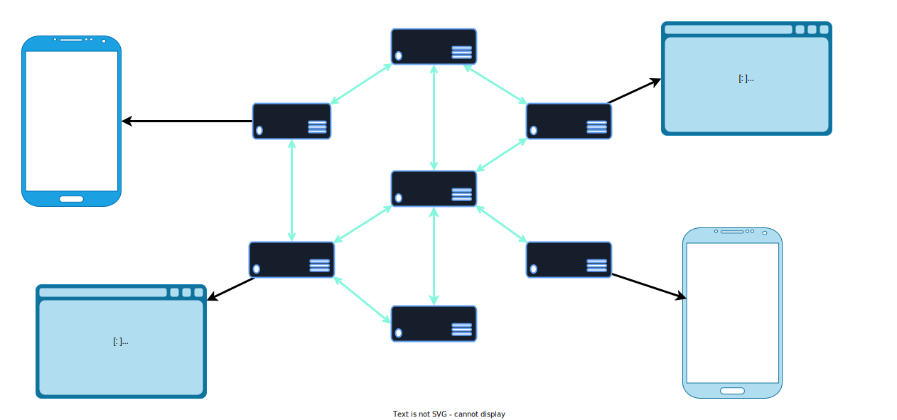

8xFF Media Server: Planet Scale Ultra-Low Latency Streaming Server written in Rust

This is a media server that supports multiple protocols, including WebRTC, RTMP, and SIP. It is designed to handle media streaming at a planet-scale level, making it suitable for large-scale applications.

8xFF Media Server is written in Rust, with awesome [SAN-I/O](https://sans-io.readthedocs.io/) style for better performance.

## Status: Active Development

This server is the next version of media-server, which is used in some SaaS services like Video Call, Elearning, and Broadcasting companies in Vietnam. We are working on it to create a more robust and extensible media-server for multi-purpose usage. This project is in active development, and the API can change.

We have a release plan scheduled for the end of 2023.

## What Makes it Different from Other Media Servers

- First, it is written in Rust. After a long time writing media-servers with C++, we decided to switch entirely to Rust for safety but remain performance. The Rust ecosystem also supports us a lot.
- Next, it uses an ultra-low latency SDN as a data transfer layer with native Pub/Sub style, which allows us to create a huge media server system across many regions. Imagine a user can access any server that is closest to them, then SDN takes care of the others. That allows us to create something like Earth Region or Planet Region. It seems to be liked by [Cloudflare interconnected network](https://blog.cloudflare.com/announcing-cloudflare-calls/). More information about SDN an be found at [SDN Routing](https://github.com/8xFF/decentralized-sdn/blob/master/docs/smart_routing.md)

With the above reasons, 8xFF Media Server's vision is to create a full-featured solution for:

- Overseas video conferences
- Large webinars/broadcasting
- High-quality communication applications

## Features

- Planet-level Scalable, decentralized WebRTC SFU (Selective Forwarding Unit)
- Modern, full-featured client SDKs
- Built for production
- Easy to deploy: single binary, Docker, or Kubernetes
- Advanced features including:
   - [x] Audio Mix-Minus
   - [x] Simulcast/SVC
   - [x] SFU
   - [x] Planet Scale SDN (like [Cloudflare interconnected network](https://blog.cloudflare.com/announcing-cloudflare-calls/))
   - [] Recording
   - [] RTMP
   - [] SIP
   - [x] WebRTC
   - [] Whip/Whep

## Why Rust

We chose Rust for this project due to its exceptional performance and safety features. Rust is a system programming language that guarantees thread safety without needing a garbage collector. It provides low-level control over system resources, making it ideal for system-level tasks, such as implementing a high-performance networking system.

## Why [SAN-I/O](https://sans-io.readthedocs.io/)

Media Server will receive huge data transfer and run for very long time, we must avoid bugs as much as possible to avoid interrupting sensitive applications like Video/Audio calls, or large webinar sessions. If logic code depends on I/O, it will be harder for testing, so we chose San-I/O model to decouple logic and I/O as much as possible for easier testing purposes.

## Docs

TODO

## Live Demos & Samples

TODO

## SDKs

- JS (public soon)
- React (public soon)
- React Native (public soon)
- Rust (public soon)
- Flutter (contributor welcome)
- Native iOS (contributor welcome)
- Native Android (contributor welcome)