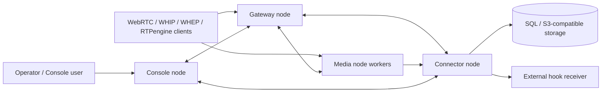
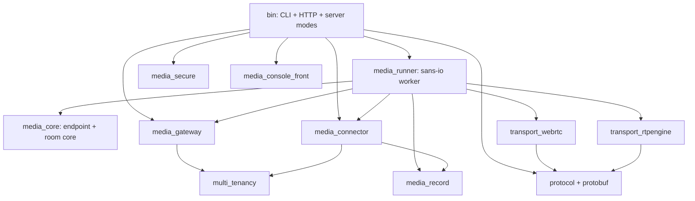

# Architecture

atm0s-media-server is a Rust workspace organized around one CLI binary and a set of reusable crates. Nodes communicate through `atm0s-sdn` and a Quinn-based virtual network for inter-node RPC.

## System Context

## Server Modes

- `console`: joins SDN, serves console UI/API, exposes cluster views and seed discovery.
- `gateway`: joins SDN, subscribes to gateway/connector/media services, selects destinations, serves token/media APIs and sample assets, optionally syncs multi-tenancy app data.
- `connector`: joins SDN, persists rooms/peers/sessions/events with SQL storage, sends hooks, handles connector RPC.
- `media`: starts one media runtime worker per `--workers`, runs WebRTC/RTPengine transports, exposes media APIs, and sends recording upload requests through connector services.
- `standalone`: starts console, gateway, connector, and media nodes in one process using loopback SDN sockets.
- `cert`: creates self-signed certificate/key files named `certificate-<timestamp>.cert` and `certificate-<timestamp>.key`.

## Component Map

## Network And Discovery

Each process builds a `NodeConfig` from global CLI flags:

- `--sdn-zone-id` and `--sdn-zone-node-id` create the cluster node ID.
- `--sdn-zone-node-id-from-ip-prefix` can derive the node index from the last IPv4 octet of a matching interface.
- `--seeds` and `--seeds-from-url` connect nodes to neighbors.
- `--node-ip`, `--node-ip-alt`, `--node-ip-alt-cloud`, and IP/interface flags control bind and advertised addresses.

Console, gateway, and connector use `SdnBuilder`. Media uses `sans_io_runtime::Controller` with media workers. Quinn RPC runs over the virtual network created in `bin/src/quinn/**`.

## HTTP API Boundaries

- Gateway and media expose media APIs for WebRTC SDK, WHIP, WHEP, and RTPengine.
- Gateway and media expose node and metrics APIs.
- Gateway exposes token APIs. Media exposes token APIs only when `--enable-token-api` is set.
- Console exposes UI, WebSocket, user, cluster, connector log, node, and metrics APIs.
- Connector exposes only node and metrics HTTP APIs.
- The record conversion worker in `packages/media_record` has its own authenticated HTTP API.

## Storage And Hooks

Connector storage uses SeaORM-backed SQL storage for rooms, peers, sessions, and events. It also accepts S3-style URIs for record storage workflows and can send hook events to a configured `--hook-uri`.

No current NATS, RabbitMQ, or Kafka connector dependency was found in manifests or connector source.

## Known Gaps

- `--http-tls` is parsed but not passed into the inspected HTTP server startup paths.
- `--rtpengine-cmd-addr` is parsed by gateway args, but no runtime use was found in the inspected gateway flow.
- Recording code exists, but end-to-end production deployment details need verification.
