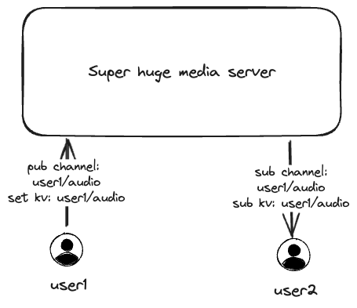
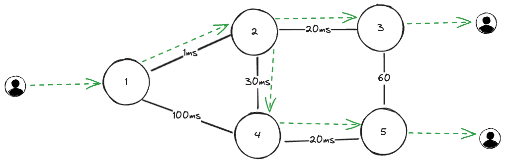
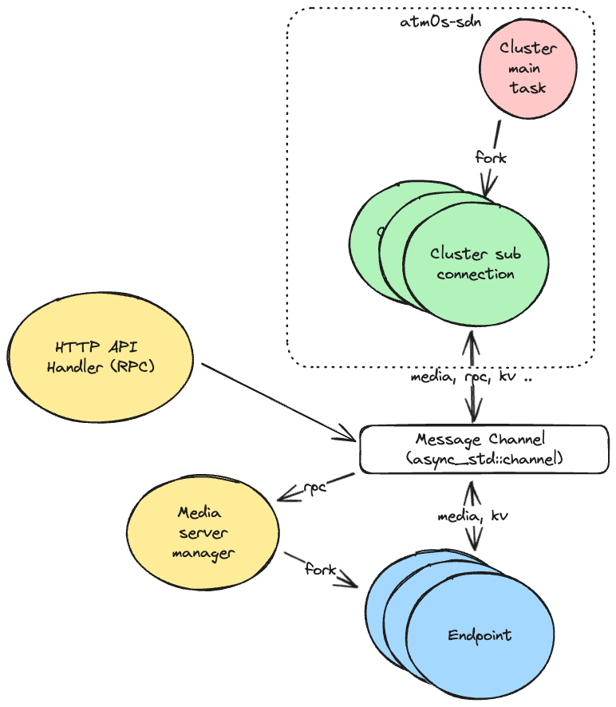

# Architecture

To understand atm0s-media-server, this document will introduce some design approaches about it. The document is split into 2 parts: abstract design and implementation design.

## Abstract design

Different from other media servers that are based on single node architecture and manual relay between nodes, atm0s-media-server is designed with a global cluster from the start. We don't rely on any single node or single source of data, you can imagine that we have a huge cluster across many zones which supports:

- Key Value store: supports HashMap, Set, Del, Sub
- Publish and Subscribe: supports publish and subscribe

For any media server, we only need some base features:

- Clients connect to the server and join a room
- Clients receive room events: peer joined, left, or stream started, updated, ended
- Clients receive stream data from other peers

Next, we will show how easy it is to implement with the KeyValue and Pubsub mechanisms.

KeyValue store:

- MapID: room identifier
- Key: peer identifier, stream identifier
- Value: peer info, stream info
- Subscriber: each peer in the room

PubSub:

- Channel: room/peer/stream as identifier
- Publisher: the peer who publishes the stream`
- Subscriber: the peers who subscribe to the stream

Each time a peer joins a room, we will set the key-value according to the peer info and the stream it published. Other peers will receive events from the key-value store and subscribe to the stream channel if needed. By doing that, audio and video data will be transferred to the peers.

When a peer leaves a room, we will remove the key-value and unsubscribe from the stream channel. Other peers will receive events from the key-value store and unsubscribe from the stream channel if needed.



About PubSub between nodes, atm0s-sdn overlay network ensures both bandwidth saving and smooth data flow. The nodes automatically select the best path between the publisher and subscriber, optimizing bandwidth usage. For example, in the network diagram below, the route path is selected to provide the most optimized and smooth data flow. With this approach, node 1 sends data to node 2 only once, and then node 2 takes care of sending the data to both node 3 and node 4, resulting in an optimized and bandwidth-saving data flow.



## Implementations

To implement the above mechanism, the source code is divided into three main components:

- Transport: This component handles communication with clients, including SIP, RTMP, and WebRTC (SDK, Whip, Whep).
- Endpoint: The endpoint component is responsible for processing the inner logic of the system, such as managing rooms and handling RPC. Additionally, middleware can be added to the endpoint to implement additional features like logging, audio mixing, and custom behaviors.
- Cluster: The cluster component facilitates communication with the key-value store and pub-sub system.

The relationship between these components is illustrated in the diagram below:


### Transport

Transport is create with single trait atm0s-media-server-transport::Transport. The trait is defined as bellow:

```Rust
#[async_trait::async_trait]
pub trait Transport<E, RmIn, RrIn, RlIn, RmOut, RrOut, RlOut> {
    fn on_tick(&mut self, now_ms: u64) -> Result<(), TransportError>;
    fn on_event(&mut self, now_ms: u64, event: TransportOutgoingEvent<RmOut, RrOut, RlOut>) -> Result<(), TransportError>;
    fn on_custom_event(&mut self, now_ms: u64, event: E) -> Result<(), TransportError>;
    async fn recv(&mut self, now_ms: u64) -> Result<TransportIncomingEvent<RmIn, RrIn, RlIn>, TransportError>;
    async fn close(&mut self, now_ms: u64);
}
```

Each transport instance will be managed by the endpoint in a simple way:

- The endpoint will call `on_tick` periodically, for example, every 100ms.
- The endpoint will pass events to the transport using `on_event`.
- The endpoint will pass custom events to the transport using `on_custom_event`. Custom events are from external sources like RPC and may be removed in the future.
- The endpoint will call `recv` to retrieve events from the transport.

The event to the Transport is defined as below:

```Rust
#[derive(PartialEq, Eq, Debug)]
pub enum TransportOutgoingEvent<RE, RR, RL> {
    RemoteTrackEvent(TrackId, RemoteTrackOutgoingEvent<RR>),
    LocalTrackEvent(TrackId, LocalTrackOutgoingEvent<RL>),
    ConfigEgressBitrate { current: u32, desired: u32 },
    LimitIngressBitrate(u32),
    Rpc(RE),
}
```

The event from Transport is defined as bellow:

```Rust
#[derive(PartialEq, Eq, Debug)]
pub enum TransportIncomingEvent<RE, RR, RL> {
    State(TransportStateEvent),
    Continue,
    RemoteTrackAdded(TrackName, TrackId, TrackMeta),
    RemoteTrackEvent(TrackId, RemoteTrackIncomingEvent<RR>),
    RemoteTrackRemoved(TrackName, TrackId),
    LocalTrackAdded(TrackName, TrackId, TrackMeta),
    LocalTrackEvent(TrackId, LocalTrackIncomingEvent<RL>),
    LocalTrackRemoved(TrackName, TrackId),
    Rpc(RE),
    Stats(TransportStats),
    EgressBitrateEstimate(u64),
}
```

### Endpoint

The Endpoint is the core logic of atm0s-media-server. It manages how to process events from the transport and how to communicate with the cluster. The Endpoint is designed with a SAN IO style, where all internal logic is independent of I/O and processed without async/await. It is implemented inside the `packages/endpoint` crate and can be defined as follows:


### Task scheduler

To support a large number of peers, we will have multiple tasks. However, for simplicity, we will only have one task for each endpoint. These tasks are created using `async_std::task::spawn`. The relationship between each task is illustrated in the diagram below:


