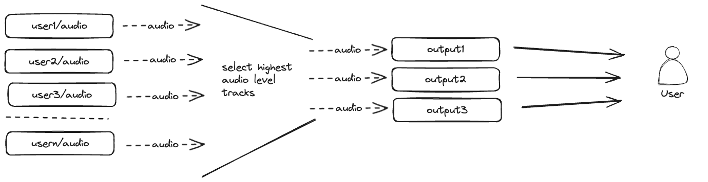

# Audio Mixer

For additional information on our audio mixer implementation, please consult the [Audio Mixer](/user-guide/features/audio-mixer.md) section in the User Guide documentation.

We have divided the fundamental virtual mix-minus logic into a distinct module known as the 'audio-mixer' module. This module operates independently and is adaptable for use in any other application.

To facilitate integration with an endpoint, we have developed middleware designed to seamlessly integrate with the endpoint's pipeline.

## Abstract Design

We have developed a new module called "audio-mixer," which receives all audio streams from other peers and selects the loudest audio track to send to the client. For flexibility, we offer two modes:

- Mixing all audio streams.
- Mixing only the most interesting audio streams.

The number of output tracks can be configured.

## Implementation Details

The core audio-mixer session will involve both input and output interactions:

**Input types:**

- `Source added` (source ID)
- `Source pkt` (source ID, audio level, audio data)
- `Source removed` (source ID)

**Output types:**

- `Output Pin` (output ID, source ID)
- `Output pkt` (output ID, audio level, audio data)
- `Output UnPin` (Output ID, source ID)

Each time a source is added, the core checks if there is a free output track. If available, it pins that output track to the respective source. When a source is removed, the core unpins that source from the output track.

Upon receiving a new audio packet, the core updates the audio level of the corresponding source. If the source wasn't pinned, the core checks if there is a pinned output track with a lower audio level than the source beyond a certain threshold. If found, the core unpins that output track and pins the source to that output track.

At periodic intervals, the core clears the audio level of all timed-out sources, which haven't received any audio packet within a specified time period.

## Potential Impact and Risks

This method relies on the assumption that the audio level of a source does not change significantly in a short period. If the audio level of a source undergoes substantial changes quickly, the core will unpin that source from the output track and pin it to another source, potentially resulting in an audio glitch.

Another challenge with this method is its dependency on receiving accurate audio level information from the source. If the source fails to send the audio level or provides incorrect information, the core may not function as intended.

## Future improvements

To optimize bandwidth usage, we employ a strategy of dividing audio stream data into multiple levels: stream metadata (which includes audio level) and actual audio data. When selecting a source for mixing, we subscribe only to the audio data level, minimizing the data transferred and reducing overall bandwidth consumption.

Additionally, we can have a normalization step to address the issue of rapid changes in audio levels. This step helps ensure smoother transitions and prevents abrupt fluctuations in audio, enhancing the overall stability of the system.

## Open Questions

- Optimizing for Many Sources in a Room: Strategies for efficiently handling scenarios where the room contains numerous sources.
- Handling Rapid Audio Level Changes: Techniques to ensure smooth transitions and prevent disruptions when the audio level of a source changes rapidly.
