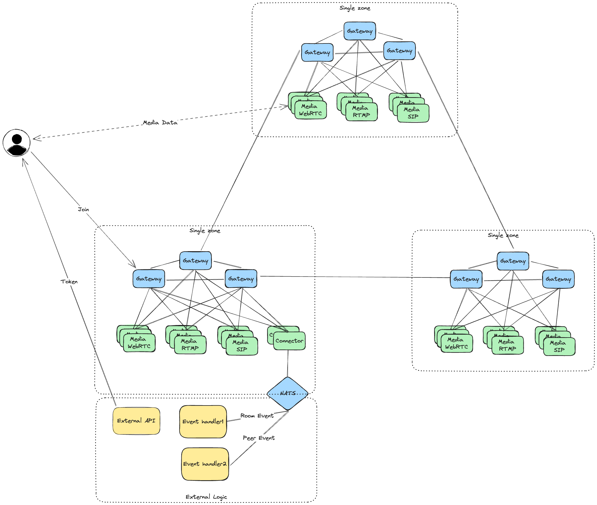

# Multi zones

You can deploy multi zones cluster to scale up your cluster. Each zone is a single zone cluster. You can deploy as many zones as you want.

Multi zones is simple some zones which interconnect with each other. In this mode, we will deploy some addition gateway nodes call global gateway nodes. These nodes will route requests to best zone based on user location and that load, some room users may be routed to different zones.

In this mode, all global gateway nodes will interconnect with each other. This will take care of route data between zones.

Note that, you can deploy multi connector in some zones to handle room and peer event, but you need to take care how to handle that event by your self to ensure data consistance.

## Prerequisites

- Pick different zone prefix for each zone, example if you have 3 zone it can be: 0x000001, 0x000002, 0x000003
- Select a secret for all zones

## Deploy each zones same as single zone cluster

The deploy step is same with single zone but from zone 2, you need to add zone1 gateway address as seed node for each gateway nodes.