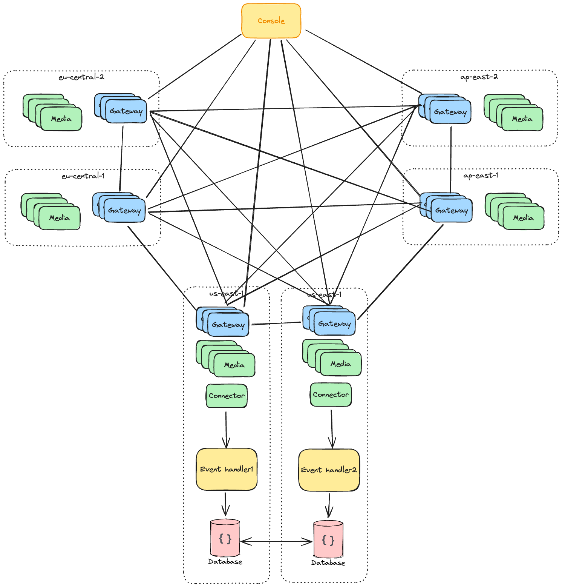

# Multi zones

You can deploy a multi-zone cluster to scale up your cluster. Each zone is a single-zone cluster, and you can deploy many zones across the regions.

In a multi-zone setup, the zones are interconnected. To achieve this, all gateway nodes are interconnected and each request will be routed to the closest zone's gateway node.

The gateway nodes also take part in routing media data between zones in the fastest path possible; data will be relayed if the direct connection is bad.

Note that you can deploy multi connectors in some zones to handle room and peer events. However, you need to handle these events yourself to ensure data consistency.

## Prerequisites

- Choose a different zone prefix for each zone. For example, if you have 3 zones, they can be named 0x000001, 0x000002, and 0x000003.
- Select a secret for all zones.

## Deploying each zone, same as a single-zone cluster

The deployment steps are the same as for a single-zone cluster with addition `--zone ZONE_ID` param. However, starting from second zone, you need to add the first zone gateway address as a seed node for each gateway node.
