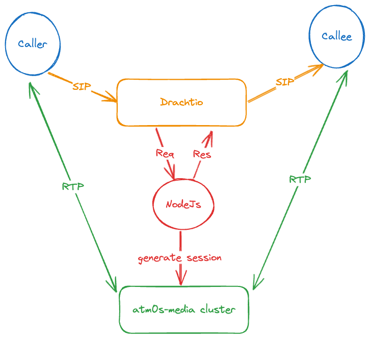

# SIP integrate

To avoid complexity, atm0s-media-server only works as an rtpengine replacement. To enable SIP, we need a signaling system that supports the rtpengine ng_control protocol (UDP) with an injected authentication token.

To demonstrate how it works, we created a simple SIP call integration in [8xFF/atm0s-media-sip-call-sample](https://github.com/8xFF/atm0s-media-sip-call-sample). In this sample:

- [Drachtio](https://drachtio.org/) works as a SIP signaling layer.
- atm0s-media-server works as a media transport layer (RTP, UDP).

In the repo, Node.js code handles events from Drachtio and initiates sessions in atm0s-media-server. After that, call legs media data is connected over atm0s-media-server. For allow atm0s-media validate connect request we need to inject atm0s_token in connect requests and connection_id in delete request:

```ts
const RtpEngine = require("rtpengine-client").Client;
const rtpengine = new RtpEngine();

const { conn, sdp } = await rtpengine.offer(
  RTP_ENGINE_CONFIG.port,
  RTP_ENGINE_CONFIG.host,
  {
    "call-id": call,
    "from-tag": from,
    "to-tag": to,
    sdp,
    "atm0s-token": token,
  }
);
```

```ts
// conn is got from above offer or answer request
async function rtpDelete(
  call: string,
  from: string,
  to: string | undefined,
  conn: string
) {
  await rtpengine.delete(RTP_ENGINE_CONFIG.port, RTP_ENGINE_CONFIG.host, {
    "call-id": call,
    "from-tag": from,
    "to-tag": to,
    "conn-id": conn,
  });
}
```



Some limitations:

- Only PCMA (8kHz, payload type 8) is supported.
- Audio is always transcoded to Opus (48kHz).
