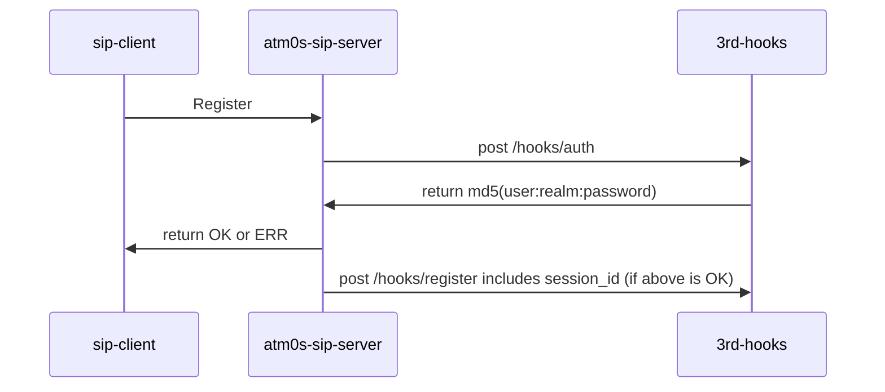
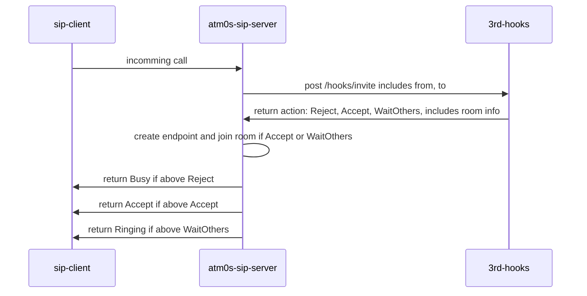
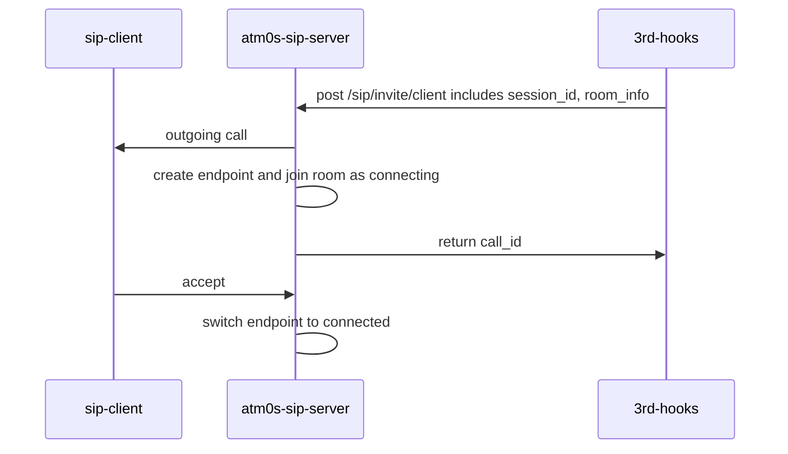

# SIP Transport integration: Working in process

Currently implement is incomplete and only finished most important parts, it working as PoC.

- It can handle incoming call to join an room or reject. It can make outgoing call and put it to a room.
- Audio process is done with OPUS and PCMA transcode.

We have reference hooks server in above.

### Checklist

Register

- [x] Client MD5 authentication
- [ ] Server MD5 authentication
- [ ] Client IP rule
- [ ] Server IP rule
- [ ] Unregister

Call

- [x] Client MD5 authentication
- [ ] Server MD5 authentication
- [ ] Client IP rule
- [ ] Server IP rule
- [x] Incoming call
- [x] Outgoing call
- [x] Audio transcode
- [ ] Call RING
- [ ] Call BUSY
- [ ] Call CANCEL
- [ ] Call END after all other members leaved

Hooks

- [x] Auth hook
- [x] Register hook
- [ ] Unregister hook
- [x] Invite hook

APIs

- [x] Invite client session
- [ ] Invite server (with or without authentication)

### Working flow

#### Register



#### Incoming call



#### Outgoing call

Call to client (Zoiper or Linphone app ...)



#### Reference hooks server

```rust
use std::{collections::HashMap, net::SocketAddr, sync::Arc};

use clap::Parser;
use cluster::rpc::sip::{
    SipIncomingAuthRequest, SipIncomingAuthResponse, SipIncomingInviteRequest, SipIncomingInviteResponse, SipIncomingInviteStrategy, SipIncomingRegisterRequest, SipIncomingRegisterResponse,
    SipOutgoingInviteClientRequest, SipOutgoingInviteResponse,
};
use media_utils::Response;
use parking_lot::Mutex;
use poem::{
    handler,
    listener::TcpListener,
    post,
    web::{Data, Json},
    EndpointExt, Route, Server,
};
use rand::Rng;

// generate 16byte hex random string
fn random_room_id() -> String {
    let mut rng = rand::thread_rng();
    let mut room_id = String::new();
    for _ in 0..16 {
        room_id.push_str(&format!("{:02x}", rng.gen::<u8>()));
    }
    room_id
}

#[derive(Clone, Default)]
struct Context {
    users: Arc<Mutex<HashMap<String, String>>>,
    sip_gateway: String,
}

impl Context {
    pub fn generate_auth(&self, username: &str, realm: &str) -> String {
        let password = username;
        let ha1 = md5::compute(format!("{}:{}:{}", username, realm, password));
        format!("{:x}", ha1)
    }

    pub fn register_user(&self, username: &str, session_id: &str) {
        self.users.lock().insert(username.to_string(), session_id.to_string());
    }

    pub fn unregister_user(&self, username: &str, session_id: &str) {
        if let Some(s) = self.users.lock().get(username) {
            if s == session_id {
                self.users.lock().remove(username);
            }
        }
    }

    pub fn get_user_session_id(&self, username: &str) -> Option<String> {
        self.users.lock().get(username).cloned()
    }

    pub async fn make_client_call(&self, room_id: &str, from_number: &str, dest_session_id: &str) -> Result<(), reqwest::Error> {
        let client = reqwest::Client::new();
        let res = client
            .post(format!("{}/sip/invite/client", self.sip_gateway))
            .json(&SipOutgoingInviteClientRequest {
                room_id: room_id.to_string(),
                dest_session_id: dest_session_id.to_string(),
                from_number: from_number.to_string(),
                hook_uri: None,
                server_alias: None,
            })
            .send()
            .await?
            .json::<Response<SipOutgoingInviteResponse>>()
            .await?;
        log::info!("make_client_call: {:?}", res);
        Ok(())
    }
}

#[handler]
fn hook_auth(req: Json<SipIncomingAuthRequest>, data: Data<&Context>) -> Json<SipIncomingAuthResponse> {
    log::info!("hook_auth: {:?}", req);
    Json(SipIncomingAuthResponse {
        success: true,
        ha1: Some(data.0.generate_auth(&req.0.username, &req.0.realm)),
    })
}

#[handler]
fn hook_register(req: Json<SipIncomingRegisterRequest>, data: Data<&Context>) -> Json<SipIncomingRegisterResponse> {
    log::info!("hook_register: {:?}", req);
    data.0.register_user(&req.0.username, &req.0.session_id);
    Json(SipIncomingRegisterResponse { success: true })
}

#[handler]
fn hook_unregister(req: Json<SipIncomingRegisterRequest>, data: Data<&Context>) -> Json<SipIncomingRegisterResponse> {
    log::info!("hook_unregister: {:?}", req);
    data.0.unregister_user(&req.0.username, &req.0.session_id);
    Json(SipIncomingRegisterResponse { success: true })
}

#[handler]
async fn hook_invite(req: Json<SipIncomingInviteRequest>, data: Data<&Context>) -> Json<SipIncomingInviteResponse> {
    log::info!("hook_invite: {:?}", req);

    if let Some(dest_session_id) = data.0.get_user_session_id(&req.0.to_number) {
        let room_id = random_room_id();
        match data.0.make_client_call(&room_id, &req.0.from_number, &dest_session_id).await {
            Ok(_) => {
                log::info!("make_client_call success: {:?}", room_id);
                Json(SipIncomingInviteResponse {
                    room_id: Some(room_id),
                    strategy: SipIncomingInviteStrategy::WaitOtherPeers,
                })
            }
            Err(e) => {
                log::error!("make_client_call error: {:?}", e);
                Json(SipIncomingInviteResponse {
                    room_id: None,
                    strategy: SipIncomingInviteStrategy::Reject,
                })
            }
        }
    } else {
        log::warn!("user not found: {:?}", req.0.to_number);
        Json(SipIncomingInviteResponse {
            room_id: None,
            strategy: SipIncomingInviteStrategy::Reject,
        })
    }
}

/// Sip Hooks Server sample. This server acts as a address book for SIP servers
#[derive(Parser, Debug)]
#[command(author, version, about, long_about = None)]
struct Args {
    /// Http port
    #[arg(env, long, default_value = "0.0.0.0:3000")]
    http_addr: SocketAddr,

    /// Sip server gateway
    #[arg(env, long, default_value = "http://localhost:8002")]
    sip_gateway: String,
}

#[async_std::main]
async fn main() -> Result<(), std::io::Error> {
    let args = Args::parse();
    if std::env::var_os("RUST_LOG").is_none() {
        std::env::set_var("RUST_LOG", "info");
    }
    tracing_subscriber::fmt::init();

    let ctx = Context {
        sip_gateway: args.sip_gateway,
        ..Default::default()
    };

    let app = Route::new()
        .at("/hooks/auth", post(hook_auth))
        .at("/hooks/register", post(hook_register))
        .at("/hooks/unregister", post(hook_unregister))
        .at("/hooks/invite", post(hook_invite))
        .data(ctx);

    Server::new(TcpListener::bind(args.http_addr)).run(app).await
}

```