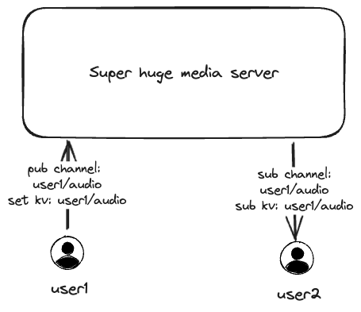
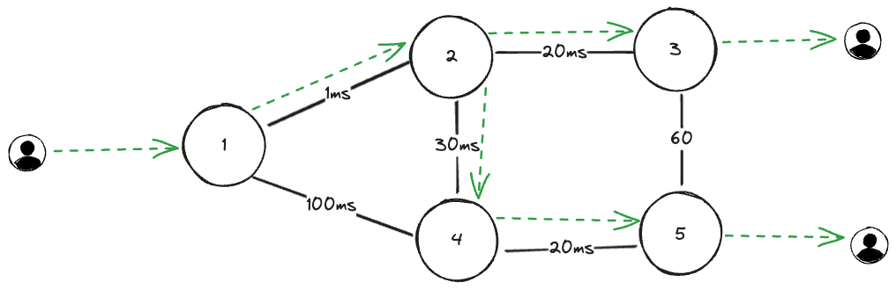

# Concepts

atm0s-media-server is designed to be a scalable, flexible and reliable media server. It can be deployed in a single zone or multi zones. In this document, we will describe how atm0s-media-server works and how to deploy it.

## Approach

We create media server with bellow appaches:

- Scale both in single zone and multi zones
- Support multiple protocols: WebRTC, SIP, RTMP
- Support multiple codecs: VP8, VP9, H264, OPUS, ..
- Fit with any stream application: video conference, live streaming, spatial room ..
- Focus on ultra low latency
- Users in same room don't need to be routed to same media server node

## How it works

For adapt with above approachs, we design atm0s-media-server with fastest path routing algorithm, which is based on [atm0s-sdn](https://github.com/8xff/atm0s-sdn) as bellow:

- Each peer stream is a atm0s-sdn pub-sub channel
- Room and Peer metadata is stored in a atm0s-sdn key-value store

Next, we will describe how it work.

We can see in stream application we will have some rooms, each room will have some peers. Each peer will publish a stream and subscribe some streams from other peers. Each room can have some data like room name, room metadata, room settings, .. Each peer can have some data like peer name, peer metadata, peer settings. So we can store room and peer data in a key-value store. All streams can be split into sender and receiver, which is corresponding with publish and subscribe. So we can process stream data in a pub-sub channel.

With above ways, if the network can scale pub-sub publishers and number of subscribers, we can scale the media server as well.
And we can do this by atm0s-sdn with decentralized pub-sub and key-value store.

## Why it fast

Next we will describe how atm0s-media-server can be fast.

Based on atm0s-sdn, in easy explain each node have some connections to other nodes, and each node have route table which known which path is best path to go to any other nodes. The route table is periodically updated by atm0s-sdn. So this route is adapt with network changes in very short time.

With kv store, we will known which node is holding data for any channel, so we can sending SUB message to that node. And we can ensure that the sending path is fast. In the way the SUB message is sending, if the received node is already subscribe to that channel, it will reuse subscription. By that way, if have many nodes subscribe to same channel, the publisher is only send data to some number of nodes not greater than the number of connected neighbours. Which will ensure both thing:

- The publisher is not overload by sending data to many nodes
- The data path between publisher and subscriber is fast

## How to use

For using media-server we will need some sdk or client:

- Whip/Whep
- WebRTC SDK (js, react, react-native ...)
- SIP client
- RTMP client

With WebRTC SDK, we have most flexible way to create a streaming application, we will have:

- sender: publish a stream
- receiver: subscribe a any stream, can switch between streams or disable/enable.

For control quality of streams, which is very important for streaming application, we will have 3 params:

- priority
- max, min spartial
- max, min temporal

With above params, which can be config with receiver, server will calculate how many bitrate should be send to receiver. And with bitrate, we will select which layer of simulcast/svc should be send to receiver.