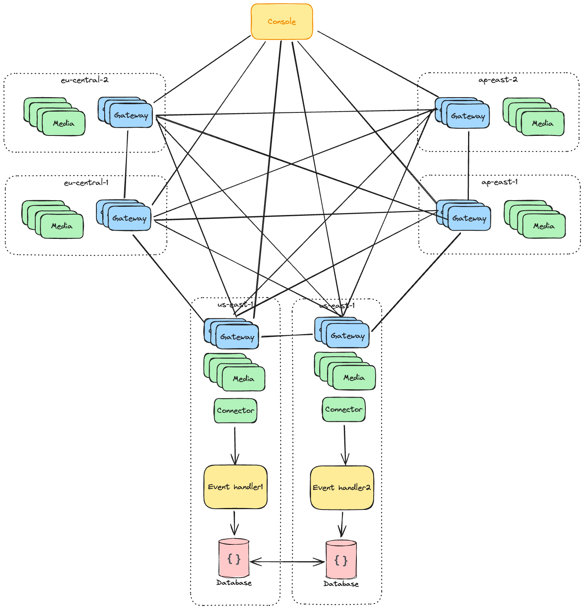

# Concepts

## Introduction

atm0s-media-server is a scalable, flexible, and reliable media server designed to meet the needs of modern streaming applications. Whether deployed in a single zone or across multiple zones, atm0s-media-server provides a powerful solution for handling media streams.

In this document, we will explore the key concepts behind atm0s-media-server, its approach to media streaming, how it works, why it is fast, and how to use it effectively.

## Approach

We create atm0s-media-server with the following approaches:

- Decentralized: no single point of failure, and no single point of control, no persistent state.
- Global: the media server can be deployed in multiple zones, ensuring global scalability and reliability.
- Ultra Low Latency: the focus of atm0s-media-server is on achieving ultra-low latency, ensuring real-time communication and smooth streaming experiences.
- Easy to use: easy to deploy product ready multi-zones cluster, with a single binary, Docker, or Kubernetes.
- Extenable: atm0s-media-server is designed to be extended with new features and protocols, such as SIP, RTMP, and more.

## Key Features

- Scalability: atm0s-media-server can scale both in a single zone and across multiple zones, allowing for handling large volumes of media streams.
- Protocol Support: It supports multiple protocols such as WebRTC, SIP, and RTMP, providing flexibility for different streaming applications.
- Codec Support: atm0s-media-server is compatible with various codecs including VP8, VP9, H264, OPUS, and more, ensuring compatibility with different media formats.
- Versatility: It is designed to fit any stream application, whether it's video conferencing, live streaming, or spatial room applications.
- Ultra Low Latency: The focus of atm0s-media-server is on achieving ultra-low latency, ensuring real-time communication and smooth streaming experiences.
- Smart Routing: Users in the same room are not required to be routed to the same media server node, allowing for efficient load balancing and improved performance.

## How it works

atm0s-media-server is designed to ensure smooth operation and seamless integration with its approaches. It leverages the power of [atm0s-sdn](https://github.com/8xff/atm0s-sdn) for fastest path routing.

- Each peer stream is treated as a pub-sub channel within atm0s-sdn.
- Room and peer metadata are stored in a decentralized key-value store within atm0s-sdn.

With the above approaches, we can support both complex applications such as video conferencing and simple applications such as live streaming.

## Why it fast

Next, let's explore how atm0s-media-server achieves smooth and efficient operation.

Based on atm0s-sdn, each node establishes connections with other nodes and maintains a route table that determines the best path to reach any other node. This route table is continuously updated, allowing for quick adaptation to network changes.

Using the key-value store, we can easily identify the node responsible for a specific channel and send subscription messages directly to that node. This ensures a fast and optimized data path. Additionally, if a node is already subscribed to a channel, it can reuse the existing subscription. This approach minimizes the number of nodes that receive data from the publisher, resulting in:

- Reduced load on the publisher by limiting the number of data transmissions
- Fast and efficient data transmission between the publisher and subscribers

## Why it scalable

With decentralized designed, atm0s-media-server can be deployed in multiple zones, ensuring global scalability and reliability. Each zone is a single-zone cluster with hundreds nodes, and you can deploy many zones across the regions.

## Wide range of protocols and clients

The server supports following SDKs or clients:

- Whip/Whep
- WebRTC SDK (JavaScript, React, React Native, etc.)
- SIP client
- RTMP client
- Other protocols can easily be added

When using the WebRTC SDK, you have the most flexible way to create a streaming application. You can:

- Publish multi streams to a room.
- Subscribe to any stream and switch between streams or disable/enable them.

To control the quality of streams, which is crucial for a streaming application, you can configure the following parameters:

- Priority
- Maximum and minimum spatial resolution
- Maximum and minimum temporal resolution

Based on these parameters, the server will calculate the appropriate bitrate to send to the receiver. The bitrate will determine which layer of simulcast/SVC should be sent to the receiver.
