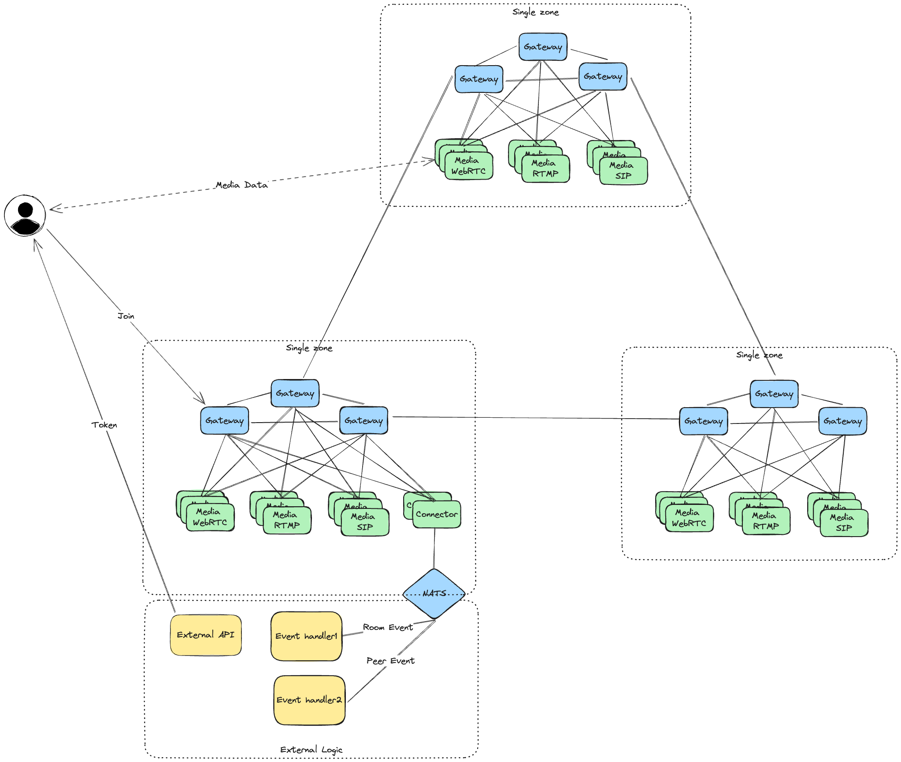

# Cluster

Atm0s Media Server support cluster mode out of box, all nodes in cluster will be auto discover each other and route request to best node automacally. 

We can have multi gateway nodes, multi media-server nodes in a cluster, which ensure high availability and scalability. We also dont need any persistent database for cluster, all data will be store in memory with the help of decentralized key-value. In case of the node holding the data is down, the data will be automatic sync to other nodes in cluster after a while. The logic behind this is similar to [Kademlia DHT](https://en.wikipedia.org/wiki/Kademlia) where node for each key is select and route by XOR operator.

We have 2 cluster mode: single zone and multi zones.

