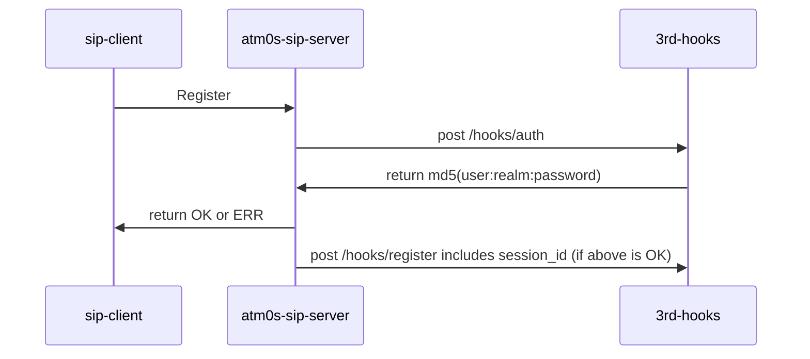
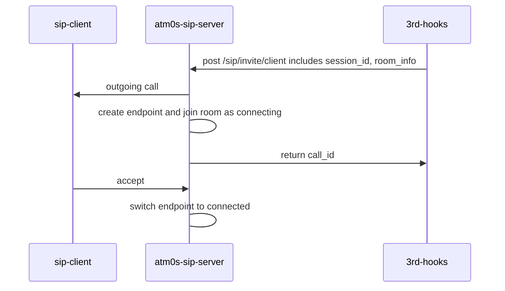

# Integration

## Integration Methods

We support integration with other systems through the following methods:

- **Token generation logic and client SDK**: Generate and validate tokens for authentication.
- **HTTP API**: Manage, kick, and make calls using HTTP endpoints.
- **Message queue**: Handle events using a message queue. Currently, only Nats is supported, but it can easily be expanded to support more types.
- **SIP integration with Hooks**: Handle SIP integration with Hooks for authentication, registration, unregistration, and invitation.

## Token Generation and Validation

The media server employs an efficient and secure approach for token generation and validation. It does not store any token information in its database and does not rely on external services for token validation. Instead, each node in the cluster validates tokens based on its configuration.

Currently, the media server uses JWT with a static cluster secret for token generation. However, there are plans to expand this functionality in the future, including options such as public-private key and hierarchical key (bip32).
To learn more about token generation mechanisms, refer to the table in the section above.

Supported token generation mechanisms:

| Type               | Token                  | Status |
| ------------------ | ---------------------- | ------ |
| Static Secret      | [JWT](https://jwt.io/) | Done   |
| Public Private Key | [JWT](https://jwt.io/) | TODO   |
| Hierarchical Key   | [JWT](https://jwt.io/) | TODO   |

We can use token-generate APIS to generate tokens. To do this, you will need to start the `token-generate` service by:

```bash
atm0s-media-server --http-port 3100 token-generate
```

And access to the Swagger dashboard at http://localhost:3100/ui/ for expolering APIS.

Or you can generate by any JWT library with body:

```json
{
  "sub": "app1",
  "exp": 1703752294122,
  "room": "room1",
  "peer": "user1",
  "protocol": "webrtc",
  "publish": true,
  "subscribe": true
}
```

In there:

- `sub`: subject, it is optional, it is used to identify the application.
- `exp`: expiration time, it is optional, if not defined the token will be valid forever.
- `room`: room name, it is optional, if not defined the token will be valid for all rooms.
- `peer`: peer name, it is optional, if not defined the token will be valid for all peers.
- `protocol`: protocol name, required, it can be `webrtc`, `sip`, `rtmp`, `whip`, `whep`.
- `publish`: publish permission, required.
- `subscribe`: subscribe permission, required.

## HTTP APIs

We have some HTTP APIs for managing, sessions. The APIs are defined as below:

| Method | Endpoint                     | Body | Response              | Description  |
| ------ | ---------------------------- | ---- | --------------------- | ------------ |
| DELETE | GATEWAY/webrtc/conn/:conn_id | none | `{ status: boolean }` | Close a peer |
| DELETE | GATEWAY/whip/conn/:conn_id   | none | `{ status: boolean }` | Close a peer |
| DELETE | GATEWAY/whep/conn/:conn_id   | none | `{ status: boolean }` | Close a peer |

## External event handling with message queue

For processing events, we use a message queue. Currently, only Nats is supported, but it can easily be expanded to support more types. Each time a room or peer event occurs, it will be sent to the message queue and processed by the connector node.
Supported events please see [Protobuf](/packages/protocol/src/media_endpoint_log.proto))

## SIP integration with Hooks

For SIP integration, we use Hooks. Currently, only HTTP Hooks are supported. Each time a SIP event occurs, it will be sent to the Hook Endpoint. To make an outgoing call, an external service needs to send an invite request to the HTTP endpoint of SIP.

Hooks:

| Type       | Endpoint          | Body      | Response                               | Status |
| ---------- | ----------------- | --------- | -------------------------------------- | ------ |
| Auth       | /hooks/auth       | body here | return SIP HA1 hash or reject          | Done   |
| Register   | /hooks/register   | body here | Save to db                             | Done   |
| Unregister | /hooks/unregister | body here | Remove from db                         | Done   |
| Invite     | /hooks/invite     | body here | return action: reject, or move to room | Done   |

Actions:

| Type   | Endpoint        | Body      | Respinse      | Description                |
| ------ | --------------- | --------- | ------------- | -------------------------- |
| Invite | /actions/invite | body here | response here | For creating outgoing call |

### Working flow

#### Register



#### Incoming call


#### Outgoing call

Call to client (Zoiper or Linphone app ...)


