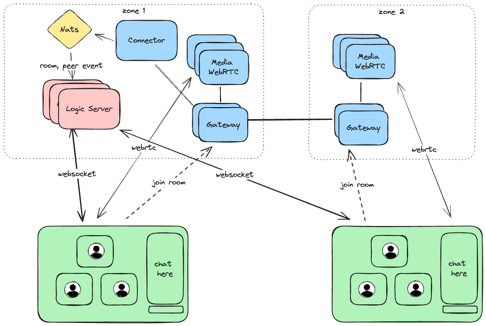
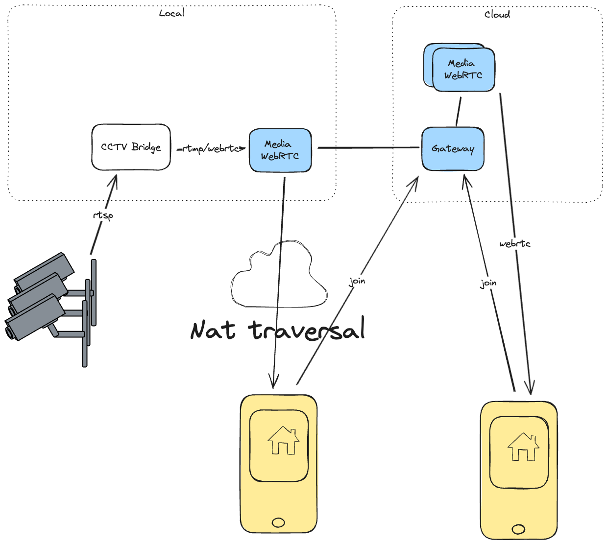
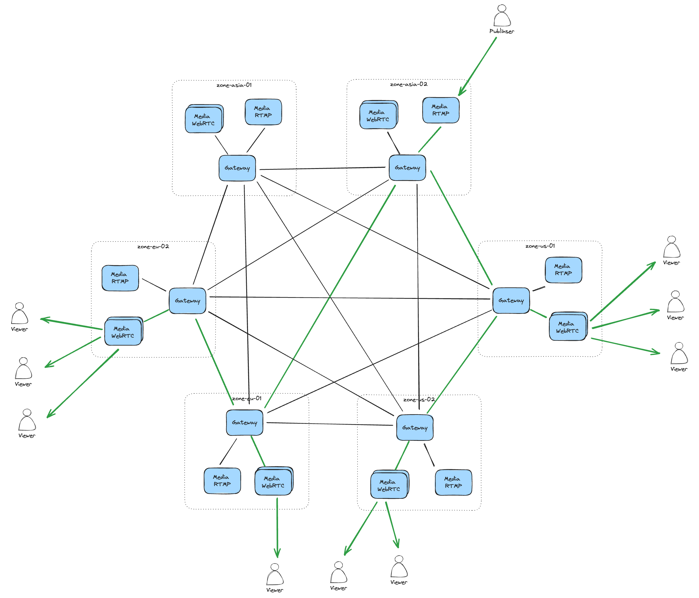

# Usage example

This example shows some usage examples of the atm0s-media-server

### Video conference

Video conference mainly used with at least 2 region, thefore we need to deploy multi zones cluster. We will have video-conference logic in a main zone, and some other zones will be used for media server. We also have some addition feature like slide, drawing, that will be handle by main zone over websocket connection.

### CCTV system

Atm0s Media Server can act as broadcast layer for CCTV system, which can be view by wide range of devices like: web, mobile, smart tv. This also support large of viewer, which can be scale up by adding more media server nodes on the cloud. The network topology is simple, we can work with edge only nodes or connect with cloud for providing more addvance feature like.

This also can be use to add a cctv system to a video conference room.

### Broadcast

Atm0s Media Server can be use for ultra-low-latency broadcast system, which can archive under 500ms latency.
We can use scale and multi-zone features to scale up the system with large number of viewers over the world.

Ingress can be multi protocol like: WHIP, RTMP, or WebRTC SDK.
Engress can be multi protocol like: WHEP, or WebRTC SDK.
Media-over-Quic is considered as a future protocol for this usecase.

In this usecase, with the help of smart-routing feature, we can ensure that the publisher is not overload by sending data to many nodes, and the data path between publisher and subscriber is fast.

### Clubhouse clone

Same with above video conference, we can work with audio only mode and mix-minus features, which can be use for a huge audio room without audio transcode. Only most highest volume audio stream will be send to other peers. Typically we chose 3 most highest volume audio stream to send to other peers.